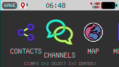
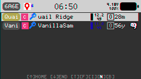
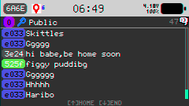
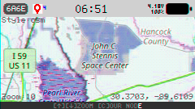
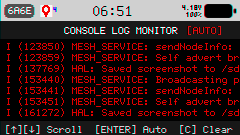
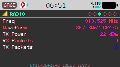
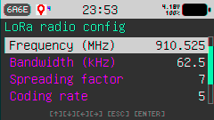

# Plai-Meshcore (v0.81beta)

Plai-Meshcore is a port of the beautiful **Plai** M5Stack Cardputer communicator application from Meshtastic to the lightweight, decentralized **MeshCore** networking stack. 

This repository decouples the Plai UI from the heavy Meshtastic backend, tying the user interface directly to MeshCore's peer-to-peer and group messaging framework.

---

## ⚡ Quick Web & M5Burner Flashing

To prevent boot loops when coming from stock M5Stack firmware or Meshtastic, use the pre-merged **factory binary** (`0x0` offset):

1. Download **`plai-meshcore-factory.bin`** from the [Latest GitHub Release](https://github.com/sjoyce1/Plai-Meshcore/releases/latest).
2. Connect your **M5Stack Cardputer** to your computer via USB-C.
3. Open **M5Burner** or a Web Serial flasher such as **[https://meshcore.io/flasher](https://meshcore.io/flasher)** (or [Web ESPTool](https://espressif.github.io/esptool-js/)).
4. Select your Cardputer's USB COM port, select `plai-meshcore-factory.bin` to flash at offset address **`0x0`**, and click **Flash**!

*(Note: If updating an existing Plai-Meshcore installation, you can also flash `plai-meshcore.bin` at offset `0x10000`).*

---

## 🚀 Key Features

* **Premium UI**: Retains the complete, feature-rich LovyanGFX and Mooncake UI components of Plai.
* **MeshCore Protocol Stack**: Powered by the lightweight, decentralized MeshCore stack, optimized for ESP32 hardware.
* **Direct Messaging (P2P)**: Ed25519-signed, Curve25519 ECDH-encrypted, authenticated peer-to-peer 1-on-1 private messaging.
* **MeshCore ACK Protocol**: Fully automated over-the-air ACK packet (`PAYLOAD_TYPE_ACK`) responses to confirm DM delivery and stop sender retries.
* **Group Channel Broadcasts**: Broadly accessible mesh-wide message broadcasting with AES-128 / HMAC-SHA256 authentication.
* **Auto-Contact Discovery & GPS Adverts**: Automatic NodeDB contact creation from group message headers and Ed25519 key exchange via 30s `PAYLOAD_TYPE_ADVERT` broadcasts (including live GPS coordinates).
* **🗺️ Dedicated Full-Screen Map Engine**: Standalone interactive Slippy Map app on the main carousel with offline tile loading, custom themes (`dark`, `osm`, `satellite`), node overlays, crosshair markers, and instant ESC exit to launcher.
* **📸 SD Card Screenshot Hotkey (`Fn + [`)**: Built-in screenshot tool! Pressing `Fn + [` anywhere captures the exact 240x135 screen buffer to `/sdcard/screenshots/snap_001.bmp` with audio confirmation.
* **🛰️ GPS Controls & Live Status Indicator**:
    * **On-Screen System Bar Indicator**: 🟢 Green satellite icon + sat count when fixed, 🟡 Yellow satellite + `?` when searching, hidden when disabled.
    * **Automatic GPS Time Sync**: Atomic UTC system clock synchronization upon satellite lock.
    * **Manual GPS Sync & Diagnostics**: Query satellite lock, satellite count, and UTC time directly from Settings.
* **🕒 Clock & Timezone Management**:
    * **POSIX Timezone Support**: Automatic Daylight Saving Time handling for US-Central, US-Eastern, US-Mountain, and US-Pacific timezones.
    * **OTA Mesh Clock Sync**: Automatic clock synchronization from over-the-air packet timestamps.
    * **Manual Clock Tool**: 24h `HH:MM` time adjustment in Settings.
* **🖥️ On-Screen Live Serial Console**: Color-coded, scrolling system terminal log viewer (`MONITOR` app) built directly into the UI.
* **⚡ Dynamic SX1262 Radio Reconfiguration**: Modify Frequency (MHz), Bandwidth (kHz), Spreading Factor (SF7-SF12), Coding Rate, Transmit Power (dBm), Sync Word, and PSK live without rebooting.

---

## 📱 Application & Launcher Carousel Overview

The main startup carousel features six streamlined applications in quick-access order:



### 1. 👥 CONTACTS (`AppNodes`)
Contact list, node details, 1-on-1 Direct Messaging, favorites/ignored nodes, and traceroute logs.
- **Features**: Live distance/heading calculation, RSSI/SNR signal quality meters, node search, and direct encrypted chat.




---

### 2. 📻 CHANNELS (`AppChannels`)
Group mesh chat channels for broadcasting messages across public or encrypted mesh channels.

---

### 3. 🗺️ MAP (`AppMap`)
Dedicated interactive full-screen Slippy Map tile renderer.
- **Features**: Reads offline raster tiles directly from SD card (`/sdcard/map/<style>/<zoom>/<x>/<y>.jpg`), double-precision GPS/NodeDB auto-centering up to Zoom 18, theme switching (**Tab**: `dark`, `osm`, `satellite`), node markers, and focused node detail popups.



---

### 4. 🖥️ MONITOR (`AppMonitor`)
Live on-screen color-coded system serial log console logger.
- **Features**: Real-time log capture (`ESP_LOGI`, `ESP_LOGW`, `ESP_LOGE`), manual scroll mode (**Space** to pause), and clear buffer tool (**C**).



---

### 5. 📊 STATS (`AppStats`)
System, hardware, battery, and radio statistics dashboard.
- **Features**: Formatted node info, exact radio frequency readout (`910.525 MHz`), battery voltage calibration, uptime, and mesh traffic counters.



---

### 6. ⚙️ SETTINGS (`AppSettings`)
System preferences, timezone configuration, GPS controls, radio parameters, and security keys.
- **Features**: Display brightness, sound volume, boot sounds, POSIX timezone selector, manual clock sync, map tile style selector, radio parameter tuning, and base64 Ed25519 key viewer.



---

## 📡 Default Radio & Channel Parameters

| Parameter | Default Value |
| :--- | :--- |
| **Frequency** | `910.525 MHz` |
| **Bandwidth** | `62.5 kHz` |
| **Spreading Factor (SF)** | `7` |
| **Coding Rate (CR)** | `4/5` |
| **Transmit Power** | `22 dBm` |
| **Sync Word** | `0x12` *(MeshCore Default)* |
| **Default Public Channel PSK** | `izOH6cXN6mrJ5e26oRXNcg==` (Hash `0x11`) |

---

## 🛠️ Build & Installation

### Prerequisites
* **ESP-IDF v5.5** or higher.
* **Python v3.10+** (with `protobuf` and `grpcio-tools` packages).

### 1. Clone Recursively
Ensure submodules are populated:
```bash
git clone --recursive https://github.com/sjoyce1/Plai-Meshcore.git
cd Plai-Meshcore
```

### 2. Generate Nanopb Headers
Change to the `protobufs` directory and run `protoc` via Python to compile the Meshtastic schemas with Nanopb options:
```bash
cd protobufs
python -m grpc_tools.protoc --experimental_allow_proto3_optional --plugin=protoc-gen-nanopb=../components/Nanopb/generator/protoc-gen-nanopb.bat --nanopb_out=-S.cpp:../main/meshtastic -I. -I../components/Nanopb/generator/proto/ meshtastic/*.proto
cd ..
```

### 3. Build & Flash
Set up the ESP-IDF environment and build:
```bash
# Export ESP-IDF variables (Windows Example)
. C:\Users\sjoyce1\esp\v5.5.1\esp-idf\export.ps1

# Build the project
idf.py build

# Flash and Monitor
idf.py -p COM10 flash monitor
```

---

## 📂 Architecture Overview

* **`main/mesh/meshcore_bridge.h`**: The bridge class routing data streams between the UI and the underlying MeshCore stack, including DM ACK generation, advert handshakes, and OTA clock sync.
* **`main/mesh/console_logger.h`**: Captures ESP-IDF `vprintf` log streams into a thread-safe RAM buffer for the on-screen console viewer.
* **`main/apps/app_monitor/`**: Live color-coded serial log console renderer with manual scrolling and auto-scroll modes.
* **`main/mesh/mesh_service.cpp`**: Startup initialization, node databases (`NodeDB`), automated periodic advertisement triggers, and GPS data handling.
* **`main/apps/app_nodes/`**: Contacts app featuring contact management, DM chat view, and Slippy map tile renderer.
* **`main/apps/app_map/`**: Dedicated MAP launcher app invoking the interactive map engine with instant home carousel exit.
* **`main/mesh/meshcore/`**: Lightweight decentralized networking layer managing routing tables, packet dispatch, flooding, and cryptography.
